#### HackPrinceton Hackathon Submission

<!-- PROJECT LOGO -->
<br />
<p align="center">
  <a>
    
  </a>

<!-- TABLE OF CONTENTS -->
<details open="open">
  <summary>Table of Contents</summary>
  <ol>
    <li>
      <a href="#about-the-project">About The Project</a>
      <ul>
        <li><a href="#built-with">Built With</a></li>
      </ul>
    </li>
    <li>
      <a href="#getting-started">Getting Started</a>
      <ul>
        <li><a href="#installation">Installation</a></li>
      </ul>
    </li>
    <li><a href="#contributors">Contributors</a></li>
  </ol>
</details>

<!-- ABOUT THE PROJECT -->

# About The Project ✨♻️

We were inspired to create this project after reading ongoing [**news**](https://www.businessoffashion.com/articles/luxury/luxury-brands-burn-unsold-goods-what-should-they-do-instead) about famous luxury clothing brands yearly burning their unsold inventories. It was very surpising to learn about the number of high quality goods these brands have burned when they could have recycled them or kept a better track of their supply chain in order to prevent the result. These brands also have more resources (which is why they are luxury brands) yet this problem keeps persisting which partly roots from a bigger issue of current supply chains not being sustainable enough to help brands improve their practices.

**Tetra** is a sustainable supply chain managment system that helps clothing brands have clear transparency into each stage of their supply chain while also helping them recycle more of their unsold inventory.

# Technical Backbone🖥️🌿

Tetra's technical backbone uses blockchain for business using Ethereum and Web3.js. This allows each product in the inventory to have a unique ID that can be traced and tracked to see which stages in the supply chain it has gone through (example: shipping stage, factory, supply). It will also show what types of materials this product is made out of. If this item is unsold, admins can send the item to a recycling facility. Once a product gets recycled, users of Tetra can also trace the history of the different parts that made up that product got recycled into.

Some of the completed user stories are:

- As an admin, I am able to track which product to recycle
- As an admin, I am able to add a new product to the chain
- As an admin, I am able to add or ship new materials (that are parts of the product) to the chain
- As a customer, I am able to see a history/timeline of where the materials of a product have been recycled to

## Screenshots of the web app

<p align="center">
    
<p/>

<p align="center">
    
<p/>

## Deployed at: https://tetraa.netlify.app

## Built With 💻☀️

- [React](https://reactjs.org/)
- [JavaScript](https://www.javascript.com/)
- [Ethereum](https://ethereum.org/en/)
- [Web3.js Ethereum API](https://web3js.readthedocs.io/en/v1.3.4/)
- [Truffle.js](https://www.trufflesuite.com/)

<!-- GETTING STARTED -->

## Getting Started

This section will work you through how you can get started with the project.

### Installation

1. You will need NodeJS, Yarn, Web3.js and Truffle.js for this project.
2. Clone the repo
   ```sh
   git clone https://github.com/APiligrim/Tetra.git
   ```
3. CD into the project directory
   ```sh
   cd Tetra
   ```
4. CD into web folder
   ```sh
   cd web
   ```
5. Install yarn packages
   ```sh
   yarn install
   ```
6. Start the Server
   ```sh
   yarn start
   ```
7. For the backend server
   ```sh
   cd ../server
   ```
8. Install yarn packages
   ```sh
   yarn install
   ```
9. Start the Server
   ```sh
   yarn start
   ```
   <!-- LICENSE -->

## License

Distributed under the MIT License. See `LICENSE` for more information.

<!-- CONTACT -->

## Contributors

1. Tayeeb Hasan - [github](https://github.com/flozender)
2. Krishna - [github](https://github.com/JethroGibbsN)
3. Anastasiya Uraleva - [github](https://github.com/APiligrim)

<!-- SCREENSHOTS -->

## Screenshots

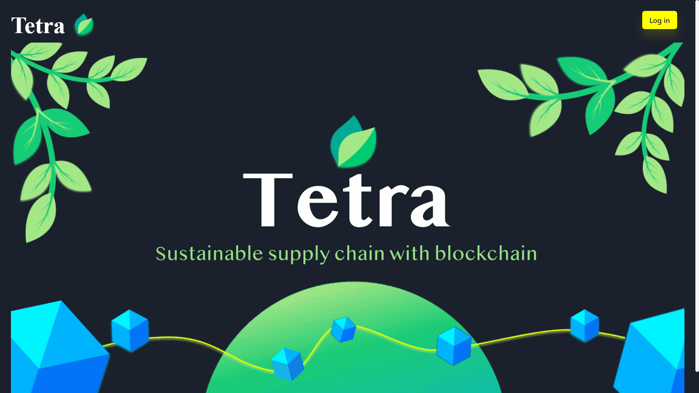
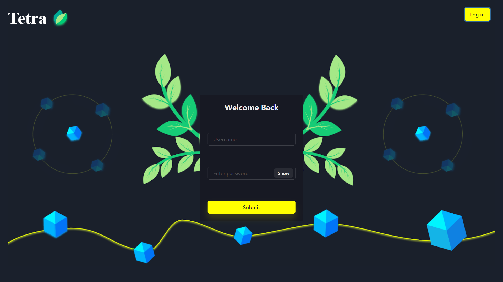
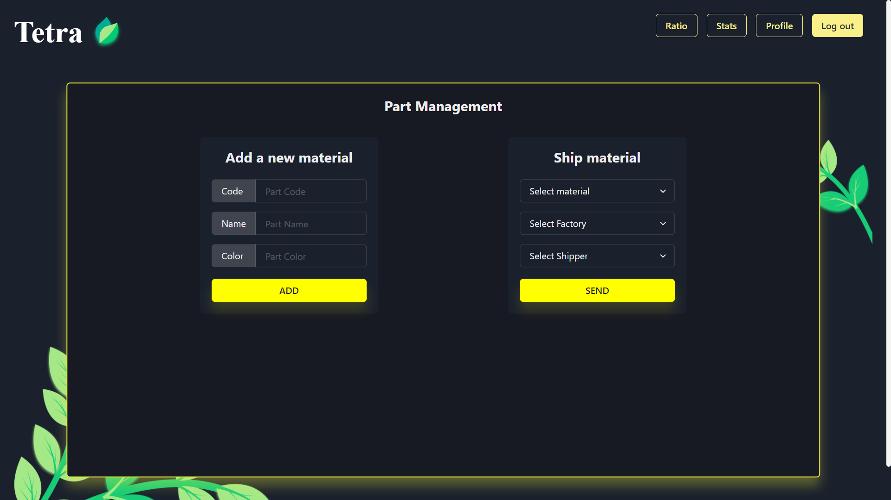
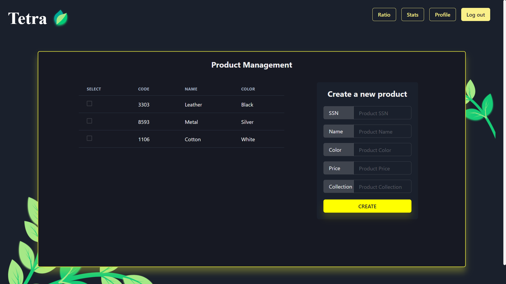
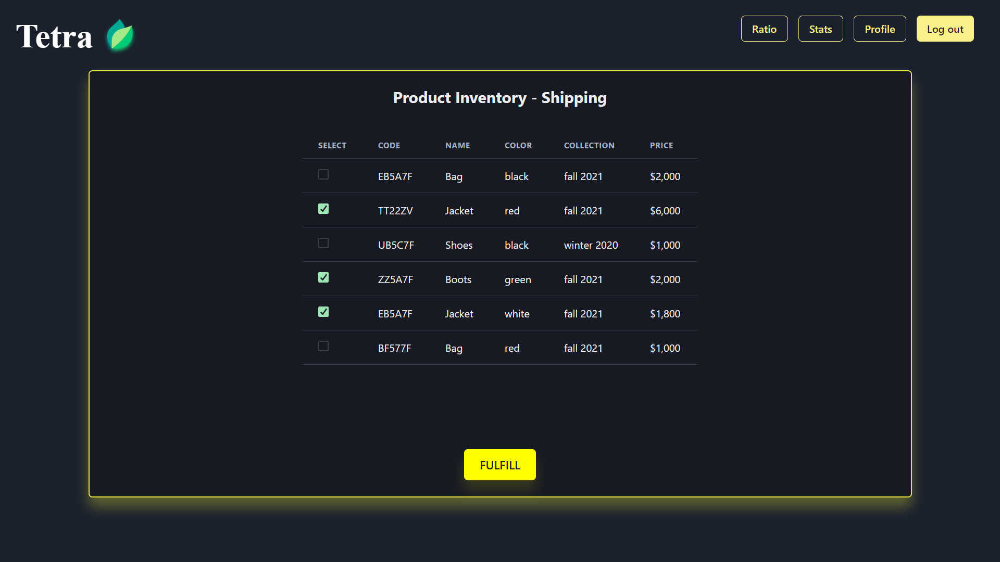

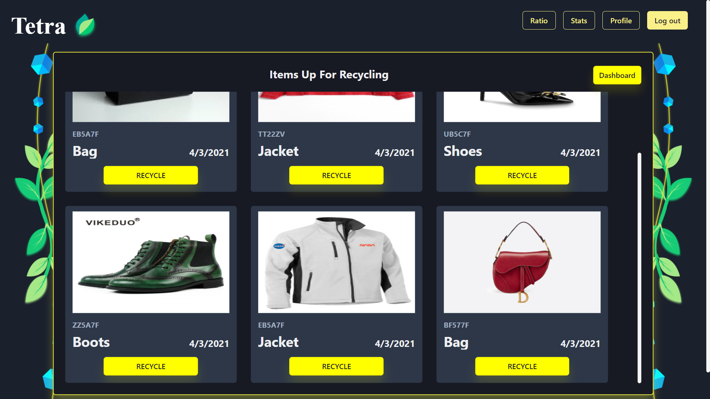
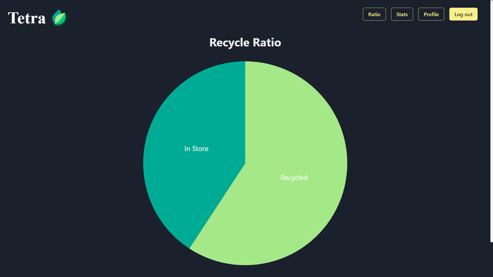
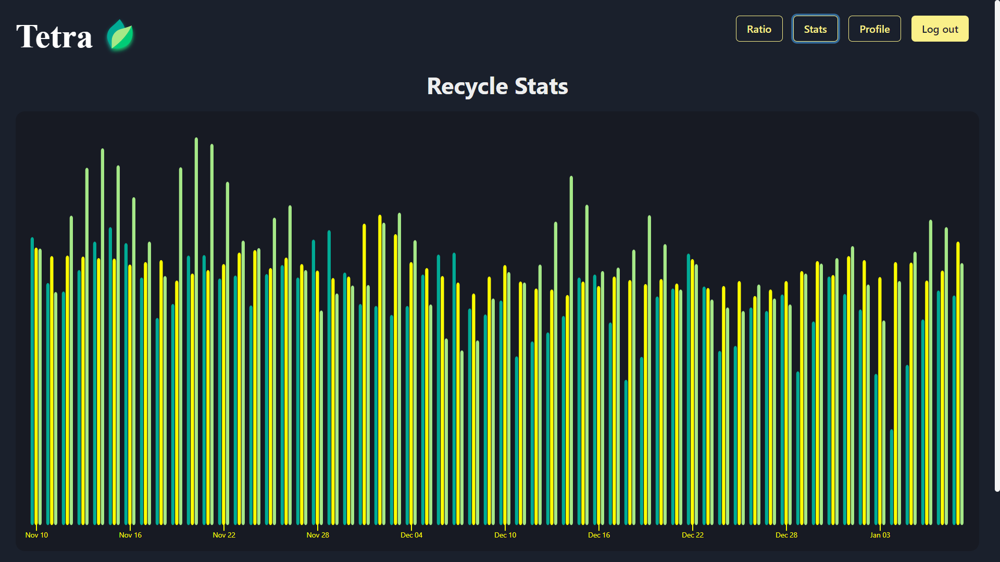
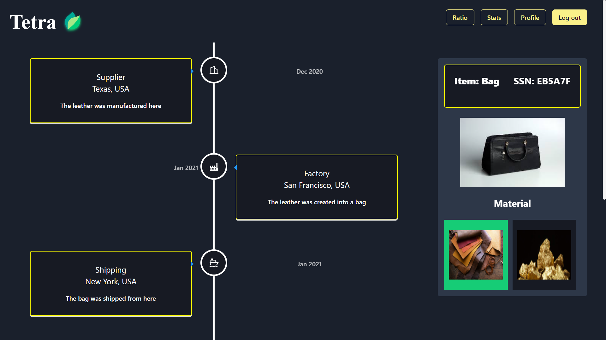
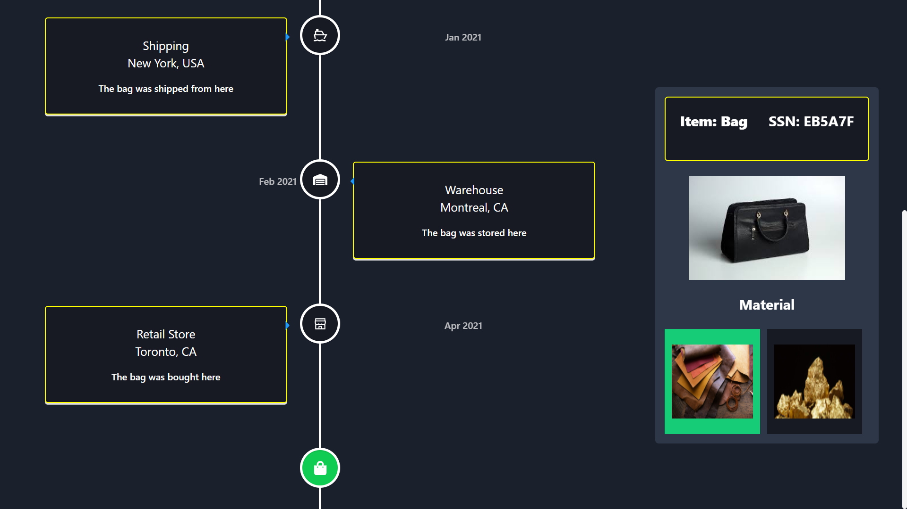
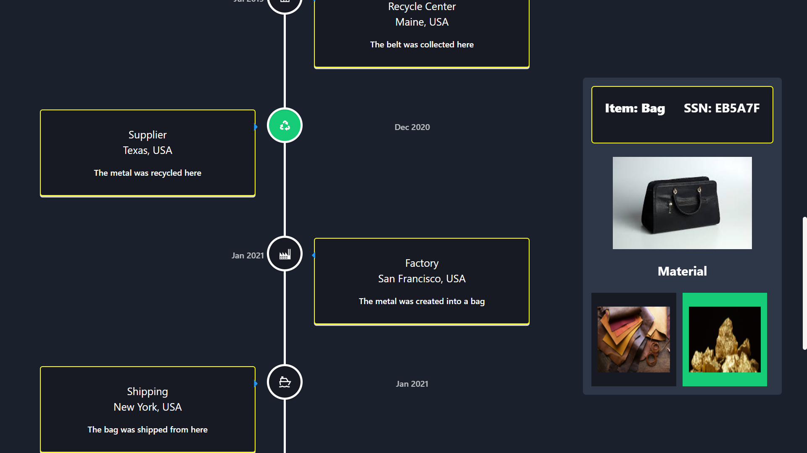
